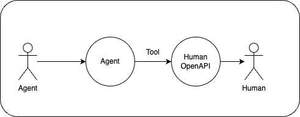

# Agent Relay

Agents need to be accessible from anywhere. The Agent Relay makes agents accessible from messaging apps, VoIP and phonecalls, and over email!


Agents need to be able to have long interval back-and-forth with humans. The Human OpenAPI makes this possible.



# Usage

1. Make your agent available as API [here](https://agent.actionschema.com)
2. Calculate your webhooks [here](https://agent-relay.actionschema.workers.dev)
3. Add the webhooks to your telecom channels of your choice

# Twilio STS Agent

This is a POC of Deepgram Agents Twilio Integration, hosted on CloudFlare Workers.

> Deepgram agent api: It’s a single, unified websocket API for building end-to-end voice agents. It lets you stream voice audio in, and get human-like voice responses back in real-time through a raw audio stream. It handles all of the conversational nuance to make the bot flow like a real human conversation. It’s very low-latency, and you can interrupt it without any additional logic - it just works.

# Contributing

- **Setup Tunnel**: I followed [this guide](https://developers.cloudflare.com/cloudflare-one/connections/connect-networks/get-started/create-local-tunnel/) to connect localhost to a public domain with `npm run serve`. This is free if you have any domain pointed at cloudflare.

# Deploy it yourself

```
npm install -g wrangler
git clone https://github.com/CodeFromAnywhere/agent-relay.git
cd agent-relay
wrangler deploy
```

Take the resulting `*.workers.dev` URL as base url, and add the required path to get your webhooks.
