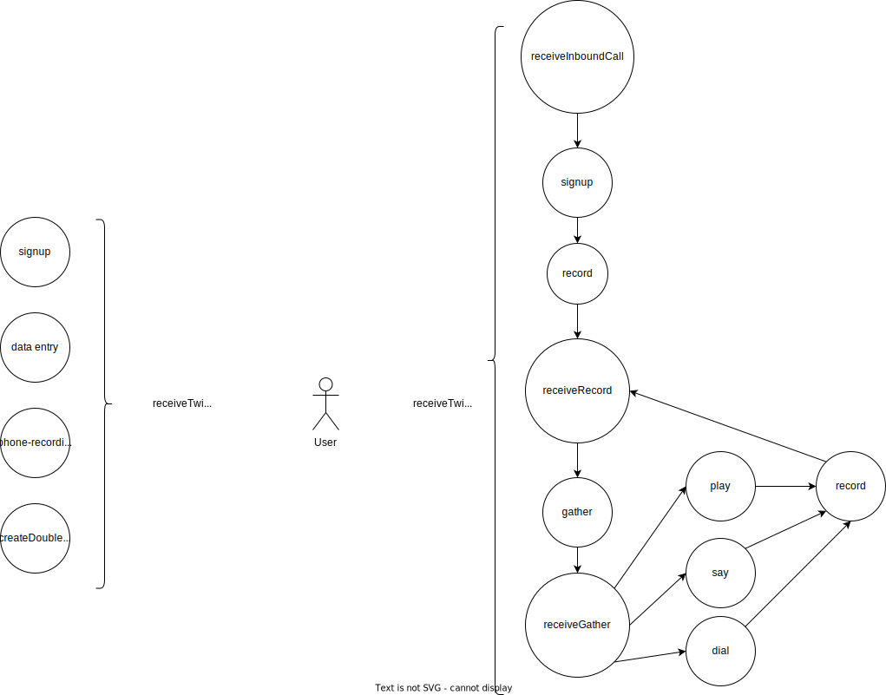

<!-- For now keep it in here -->

# Open Human

Open Human facilitates programmatic access to human beings. It does so by creating a more developer and agent-friendly ecosystem of highly documented tooling to interface with individuals, and their information.

Currently there are two ideas: The idea for 'Human Expo' and the idea for a 'Twilio Relay'. Human expo can be done without Twilio relay and vice versa. In the long run it's probably better to split up these two concepts.

# Human Expo

**Human Expo** Makes it easy to expose (and find) information about humans.

- Ability to expose relevant information for humans in a specific area
- Ability to make these humans discoverable with search.
- Ability to allow a Human to verify
- Right to remove
- Specify communication policy and other policies, with different ways for senders to authorize.
- Offer an openapi for each human, with:
  - an endpoint for each communication method that is possible.
  - endpoints for different information about these people, scraped.

# Twilio Relay

**Twilio Relay** is an API that allows you to match incoming with outgoing communication. Inspired by the [1920s switchboard operator](https://en.wikipedia.org/wiki/Telephone_switchboard), Twilio Relay offers an Open Source OpenAPI to better communicate with your users and clients.

Twilio Relay offers people the ability to create different communiation channels and provide APIs for using those. The advantage of BYOK to openapi is you can send to anyone.

- Ability to signup with your twilio/sendgrid creds.
- Get an openapi for each "persona". each persona can have multiple phonenumbers and email-senders connected so no mistakes can be made.
- Ability to proxy through incoming calls and/or store them
- Ability to store outgoing and incoming messages and emails
- Match incoming with outgoing communication

# An Example:

- `telecom.actionschema.com/human/wijnandkarsens/openapi.json` would be where people can contact me through a predetermined sender (actionschema).
- `telecom.actionschema.com/relay/screenless/openapi.json` would be where screenless can contact anyone with their own number(s) and use a callback-webhook system to propogate responses to the right place.

# TODO

- Create a form `refreshRelay` that takes twilio/sendgrid/upstash creds and stores all contact information so we can expose the listener endpoints and openapi
- For each phonenumber/email, add setup info for the user to do on twilio/sendgrid
- Storage kept by `openhuman`

  - `User { phoneNumber, email }` (in my global storage)

In the user's own db-storage:

- `Persona { userSlug, phoneNumber, email, ... }`
- `Message { personaSlug, personSlug, channel, createdAt, message, callback, ... }`
- `Person { phoneNumber, whatsappPhoneNumber, email }`
